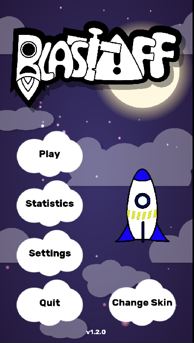
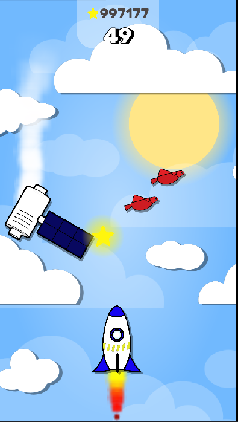
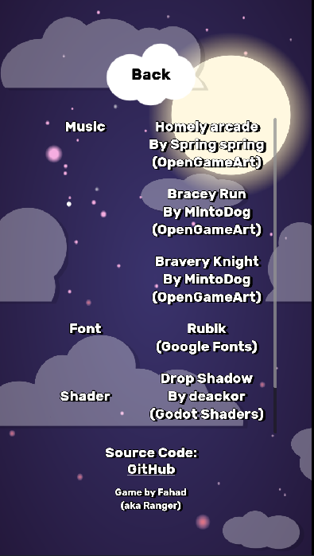

Simple 2D vertical scroller with vector graphics

Who doesn't love to endlessly cruise through the sky where birds and satellite are your enemies? This simple, yet never ending game gives you just that!

**BlastOff** is a casual endless runner with an emphasize on vector graphics. Available for web and android.

How to Play?

- **Touch/Press on the right side** to move to right
- **Touch/Press on the left side** to move to left
- Avoid all obstacles
- Survive and get high scores
- Customize your skin to you liking!!

## Intial Idea
- Simple mechanics
- Infinitely scrolling
- Polish and publish the game

## Ingame

    &nbsp;&nbsp;
    &nbsp;&nbsp;
    &nbsp;&nbsp;
    &nbsp;&nbsp;
    &nbsp;&nbsp;
    &nbsp;&nbsp;
    &nbsp;&nbsp;

## Credits [Outdated]
- Art style inspired from [Goodgis](https://goodgis.fun/)
- Music by [Spring spring](https://opengameart.org/content/homely-arcade)
- Font by [Hubert & Fischer](https://www.fontsquirrel.com/fonts/rubik)
- Drop shadow shader by [deakcor](https://godotshaders.com/shader/shadow-2d/)
- Blinking shader by [KingToot](https://godotshaders.com/shader/radar-blip/)
