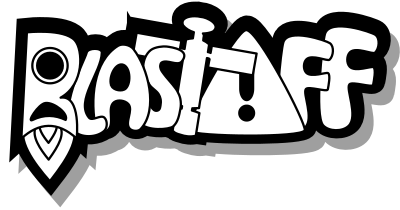

<h3 align="center">BlastOff</h3>

Simple 2D vertical scroller with vector graphics

## Idea
- Simple mechanics
- Infinitely scrolling
- Polish and publish the game

## Ingame 
> [!NOTE]
> The given screenshots does not represent the final product. The game is under heavy devolopment.

    &nbsp;&nbsp;

## Credits
- Art style inspired from [Goodgis](https://goodgis.fun/)
- Music by [Spring spring](https://opengameart.org/content/homely-arcade)
- Font by [Hubert & Fischer](https://www.fontsquirrel.com/fonts/rubik)
- Drop shadow shader by [deakcor](https://godotshaders.com/shader/shadow-2d/)

